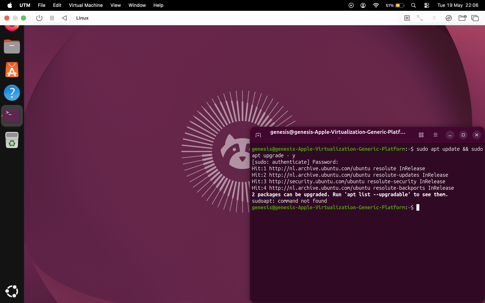

# Ubuntu Linux Practice & Notes

## Background 

I replaced Windows on my lenovo laptop with Ubuntu Linux to gain practical experience with Linux environments, terminal usage, and system maintenance.
I also used Linux as the host OS and installed virtualbox for my on-premises security homelab build in 2025.

**Update:** I upgraded to a Macbook Pro last year so I had to switch from virtualbox to UTM as that was more compatible with Apple Silicon processors.




I use this repository to keep track of commands, notes, screenshots, and small things I learn while practicing.

---

## Experience So Far

- Installed and configured Ubuntu Linux
- Used Linux as a daily operating system
- Learned basic terminal navigation and file management
- Performed system updates and package maintenance
- Used `sudo` commands for admin tasks
- Practiced troubleshooting issues using online documentation and forums
- Improved confidence working in a command-line environment

---

## Commands I Commonly Use

```bash
pwd
ls
cd
mkdir
touch
cp
mv
rm

sudo apt update && sudo apt upgrade -y
sudo apt autoremove
```

---

## Current Focus

- Becoming more comfortable with the Linux terminal
- Learning additional commands and utilities
- Understanding the Linux file system
- Improving troubleshooting and problem-solving skills
- Documenting new things I learn over time

---

## Notes

This repository is mainly a personal learning log to document my Linux practice and gradual progress using Ubuntu.
